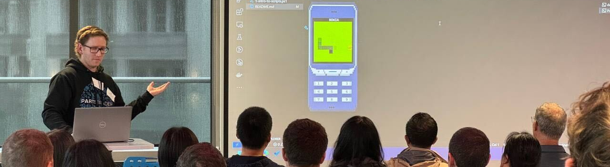

# CodeCampTalk2024

## Intro

This is the talk I gave at Code Camp Wellingtion. I've re-recorded it with hopefully fewer mistakes and uploaded the output of this live coding session in the `demo` folder. For instructions on how to get this running see [docs/README.md](docs/README.md). For the talking notes from the presentation I used see below 👇🏻

## Content

- **Who am I**  
  I'm Shaun, I work at PartsTrader.
  What's PartsTrader? Cars go vroom, have a little smash and then the repair shops use our platform to procure parts.  
  I'm Platform Engineering lead and cover things like application stability and software delivery with my team.

- **Intro to terminals**  
  Hi and welcome to my talk on CodeCamp 2024.  
  Today we are going to talk about shell scripting and terminals.  
  I've talked a few times on how terminals can be quite intimidating and I'm going to try teach a bit of terminal tech in a slightly more fun way. So today we're going to be trying to write a game in the terminal using powershell.

  - **Demo of ANSI escape codes**  
    We're going to start by digging a little bit into what the terminal is and how we can drive it. We need to get familiar with escape codes and how we can use them to control the terminal output.  
    *Show `0-escape-codes.ps1`*
  
  - **What's the game?**  
    We're going to write a simple snake game in the terminal. In preparing this my partner pointed out I'm older than I feel and some people might not be aware of the game. So here's a quick demo of what it looked like when I was playing on my Nokia at high school.  
    *Show `complete/Snake.ps1`*

- **Intro to powershell**
  - **Intro to the ps1 script**  
    What I've been running here in the terminal for the previous examples have been PowerShell scripts, which are suffixed with `.ps1`, but what do they look like?
  - Intro to the simple data types...
- Game time
  - Now we know the basics of the script. How do we represent a game in a terminal?
    - Board
    - Basic food and snake
  - Modules
    - How to write modular shell scripts
    - Move out of main script
    - Test collisions
  - Movement
    - Set a direction
    - Stretchy snake
  - Inputs
    - Ways to collect input in powershell
  - Food
    - Detect food collision
    - Rework moving snake
  - Gameover
    - How to interact with the interwebs
    - http://localhost:5187/scores
  - Testing
    - Lazy mode

- **Outro**
  - **What did we learn?**  
    We've covered a lot of ground today. We've learned how to control the terminal, how to write a simple game in PowerShell and how to test it. If you're familiar with Bash I hope you've seen some of the similarities and differences between the two. And if you're a C# developer I hope you've seen some of the similarities between C# and PowerShell.  
    PowerShell is available everywhere. It's on Windows/Linux/Mac OS/GitHub Actions/Jenkins and is a great tool to have in your toolbox.  
    I hope you've enjoyed this talk and learned something new. If you have any questions, feel free to ask them now or hit me up on linkedin/twitter they're linked on my codecamp bio.  
    Thank you for your time.  
    Profit?
